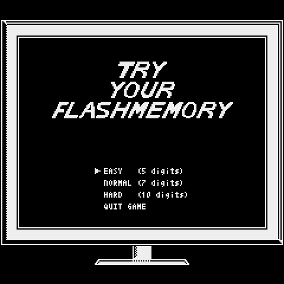
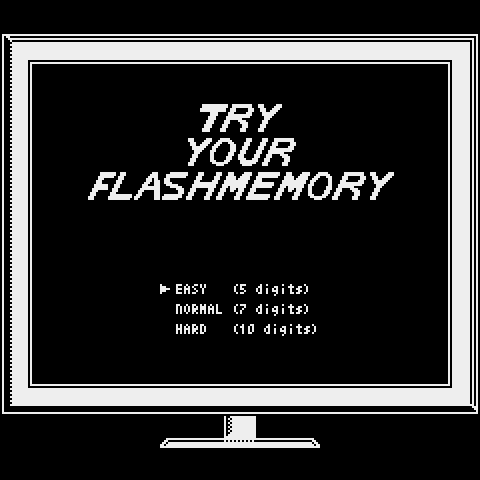

# Try Flash Memory 

## 概要
一瞬の記憶力を競うゲームです。

## 遊び方
1. 難易度を選択してください。
1. ゲームが開始します。一瞬だけ数字が表示されます。
1. 表示された数字を答えてください。
1. 全ての数字が一致すればその難易度はクリアとなります。

## スクリーンショット

## GIFアニメ

## 関連リンク
- [Pyxel Web Launcher](https://kitao.github.io/pyxel/wasm/launcher/?play=IgarashisanT.TryYourFlashMemory.TryYourFlashMemory&gamepad=enabled)